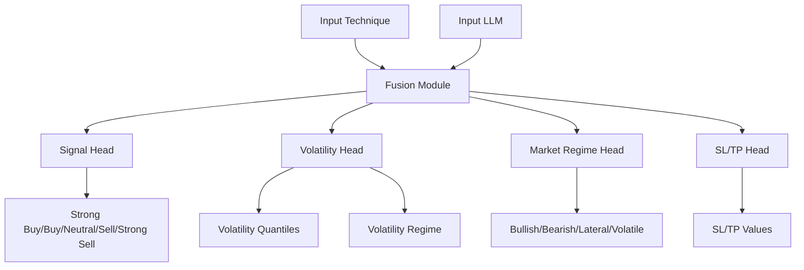

# Morningstar Hybrid Model - Documentation Technique

## Overview
Modèle de deep learning hybride multi-tâches pour le trading algorithmique crypto, combinant:
- Données techniques (38 features)
- Enrichissement par LLM (embeddings)
- Prédictions multiples:
  - Signal de trading (5 classes)
  - Volatilité (quantiles + régimes)
  - Régime de marché (4 classes)
  - Niveaux SL/TP (via RL)

## Architecture



## Prérequis Environnement
- Python 3.x
- TensorFlow 2.x
- Doit être exécuté dans l'environnement conda `trading_env`:
  ```bash
  conda activate trading_env
  ```

## Configuration

```python
model = MorningstarHybridModel(
    num_technical_features=38,  # Nombre de features techniques
    llm_embedding_dim=768,      # Dimension des embeddings LLM
    num_signal_classes=5,       # Classes de signal
    num_volatility_regimes=3,   # Régimes de volatilité
    num_market_regimes=4        # Régimes de marché
)
```

## Entrées/Sorties

### Entrées
- `technical_input`: Tensor de shape (batch_size, 38)
  - Features techniques normalisées
- `llm_input`: Tensor de shape (batch_size, 768)
  - Embeddings LLM (ex: BERT, GPT)

### Sorties (Liste plate retournée par `model.predict`)
- `signal_output`: Tensor de shape (batch_size, 5), nom: `signal_output`
  - Probabilités pour chaque classe de signal (Strong Sell, Sell, Hold, Buy, Strong Buy)
- `volatility_quantiles`: Tensor de shape (batch_size, 3), nom: `volatility_quantiles`
  - Prédiction des quantiles de volatilité (ex: 0.1, 0.5, 0.9)
- `volatility_regime`: Tensor de shape (batch_size, 3), nom: `volatility_regime`
  - Probabilités pour chaque régime de volatilité (ex: Low, Medium, High)
- `market_regime_output`: Tensor de shape (batch_size, 4), nom: `market_regime_output`
  - Probabilités pour chaque régime de marché (ex: Bullish, Bearish, Lateral, Volatile)
- `sl_tp_output`: Tensor de shape (batch_size, 2), nom: `sl_tp_output`
  - Valeurs prédites pour SL/TP (placeholder, sera affiné par RL)

## Exemple d'Utilisation

```python
from model.architecture.enhanced_hybrid_model import MorningstarHybridModel

# Initialisation
model_builder = MorningstarHybridModel()
model = model_builder.build_model()

# Compilation (les noms des sorties doivent correspondre à ceux définis dans build_model)
model.compile(
    optimizer='adam',
    loss={
        'signal_output': 'categorical_crossentropy',
        'volatility_quantiles': 'quantile_loss', # Ou 'mse' si non spécifique
        'volatility_regime': 'categorical_crossentropy',
        'market_regime_output': 'categorical_crossentropy',
        'sl_tp_output': 'mse' # Placeholder, sera adapté par RL
    },
    loss_weights={ # Optionnel: pondérer les différentes pertes
        'signal_output': 1.0,
        'volatility_quantiles': 0.5,
        'volatility_regime': 0.5,
        'market_regime_output': 0.8,
        'sl_tp_output': 0.2 
    },
    metrics={
        'signal_output': 'accuracy',
        'volatility_regime': 'accuracy',
        'market_regime_output': 'accuracy'
    }
)

# Entraînement (la liste y doit correspondre à l'ordre des sorties dans build_model)
model.fit(
    x={'technical_input': technical_data, 'llm_input': llm_embeddings},
    y={
        'signal_output': signal_labels, 
        'volatility_quantiles': volatility_quantile_targets, 
        'volatility_regime': volatility_regime_labels,
        'market_regime_output': market_regime_labels, 
        'sl_tp_output': sl_tp_targets 
    },
    epochs=50,
    batch_size=32
)
```

## Hyperparamètres

| Paramètre | Valeur Par Défaut | Description |
|-----------|------------------|-------------|
| Couche Technique | Dense(128) | Première couche de processing des features techniques |
| Couche LLM | Dense(256) | Première couche de processing des embeddings |
| Couche Fusion | Dense(512) | Couche après concaténation |
| Dropout Technique | 0.3 | Taux de dropout pour les features |
| Dropout LLM | 0.3 | Taux de dropout pour les embeddings |
| Dropout Fusion | 0.4 | Taux de dropout après fusion |

## Tests Unitaires
Des tests doivent vérifier:
1. Que le modèle accepte bien un input de 38 features
2. Que toutes les sorties sont générées avec les bonnes dimensions
3. Que les poids sont bien initialisés
4. Que le forward pass fonctionne sans erreur

## Prochaines Étapes
- Intégration de la composante RL pour SL/TP
- Optimisation des hyperparamètres
- Tests de performance sur données réelles
